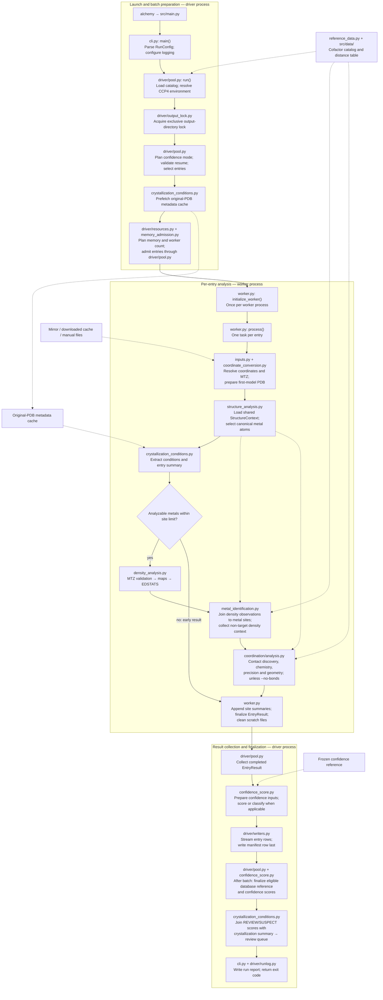
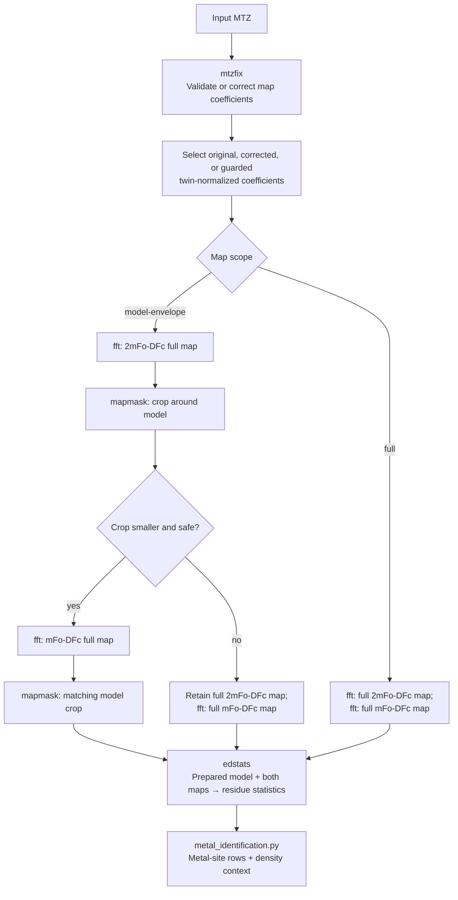

# Architecture

Alchemy runs through one launcher, `./alchemy`. The Python files under `src/`
provide functions and shared data structures used by that run; they are not a
sequence of standalone commands. The driver coordinates the batch, worker
processes analyze individual entries, and the driver writes the combined
outputs.

This page maps execution and ownership. For scientific rules, see the
[method reference](method.md); for CSV fields, see the
[output schema](output-schema.md); for retries and resource controls, see
the [operations guide](operations.md).

## Execution and data flow

Solid arrows show execution or returned results. Dashed arrows show supporting
data dependencies. The worker section is repeated for each entry; several
entries can run concurrently, while the stages within an entry run in order.
The diagram shows the normal path, with exceptions described below.

### Startup and scheduling

1. [The launcher](../alchemy) adds `src/` to the import path and calls
   [main.py](../src/main.py), which delegates to
   [cli.py](../src/cli.py). The CLI validates arguments into an immutable
   `RunConfig`, configures diagnostics, and creates the run report object.
2. [driver/pool.py](../src/driver/pool.py) loads the bundled cofactor catalog
   and resolves the CCP4 environment through [ccp4_setup.py](../src/ccp4_setup.py).
   `--configure-ccp4` saves the setup path and exits before analysis.
3. The driver acquires the output-directory lock before reading or changing
   run outputs. It determines the confidence mode, checks resume compatibility,
   and selects entries from the requested input mode. Completed entries may
   be excluded by resume policy.
4. Crystallization metadata is prefetched before expensive analysis. Manual
   input mode uses coordinate records and existing cache entries without
   downloading original-PDB metadata.
5. The driver estimates entry memory and chooses a worker-process ceiling.
   Memory admission controls how many entries are active at once; the worker
   count alone does not determine concurrency.

### One entry

[worker.py](../src/worker.py) owns the entry lifecycle and its temporary
directory. The pool initializer installs `WorkerConfig` and logging once in
each process; subsequent tasks call `process()` with a PDB ID.

Input preparation uses [inputs.py](../src/inputs.py) to locate or retrieve
files and read reflection limits and PDB-REDO metadata.
[coordinate_conversion.py](../src/coordinate_conversion.py) handles coordinate
conversion and first-model extraction. Both EDSTATS and
[structure_analysis.py](../src/structure_analysis.py) use that prepared model.
The original coordinate path is retained for deposited connection records,
crystallization context, and provenance.

After loading the structure and extracting crystallization context, the worker
checks whether analysis can proceed. Entries without selected metals return
early; unknown element symbols can make metal absence indeterminate. Entries
above `MAX_ANALYZED_METAL_SITES` also return early with an explicit reason.
These paths avoid map generation and contact analysis.

For analyzable entries, the worker runs density analysis, extracts metal
statistics, then evaluates contacts. It passes the same `StructureContext`
to identification and coordination analysis so their atom selection and
coordinate provenance agree. Finally, it merges site summaries into the
statistics rows and returns an `EntryResult` containing rows, status, counts,
timings, warnings, and provenance.

## External CCP4 execution

[density_analysis.py](../src/density_analysis.py) invokes CCP4 as subprocesses.
The default model-envelope path has the following order:

Twin normalization is a guarded recovery path after MTZFIX validation fails
for an entry explicitly marked twinned in PDB-REDO metadata. Each CCP4 invocation
has its own timeout. Maps and intermediate files belong to the worker's scratch
directory and are normally deleted after extraction; `--keep-intermediates`
preserves them.

## Coordination module relationships

[coordination/analysis.py](../src/coordination/analysis.py) orchestrates contact
analysis and returns bond rows, candidate rows, site summaries, and stage
metadata. Its collaborators have distinct responsibilities:

| Module | Responsibility |
| --- | --- |
| [structure_analysis.py](../src/structure_analysis.py) | Atom selection, model context, and neighbor searches including symmetry images. |
| [declared_connections.py](../src/coordination/declared_connections.py) | Resolve deposited `LINK` and mmCIF connection records into contact candidates. |
| [donor_chemistry.py](../src/coordination/donor_chemistry.py) | Determine which donor chemistries permit inferred contacts. |
| [dpi.py](../src/coordination/dpi.py) | Calculate coordinate-precision components used in geometry assessment. |
| [contact_record.py](../src/coordination/contact_record.py) | Carry candidate provenance, eligibility, geometry, and multi-donor assessments. |
| [reference_data.py](../src/reference_data.py) | Load and verify reference distances and cofactor classifications. |
| [metal_identification.py](../src/metal_identification.py) | Supply density-statistics lookup helpers used by contact analysis. |
| [schema.py](../src/coordination/schema.py) | Define contact/site output columns and serialize their values. |

Proximity candidates and declared connections are merged before assessment.
Candidate evidence is broader than assigned bonds. Geometry summaries feed
both the metal-site output and downstream confidence preparation.

## Outputs, confidence, and recovery

Workers return data to the driver; they do not append to the combined CSVs.
[driver/writers.py](../src/driver/writers.py) writes site, bond, candidate,
crystallization, density-context, and optional confidence rows. The manifest row
is written last as the entry's completion marker. Entries are collected as they
finish, so output order is not guaranteed to match input order.

[confidence_score.py](../src/confidence_score.py) runs in the driver and uses
the returned site and bond evidence:

| Run mode | Confidence behavior |
| --- | --- |
| Single entry, ID file, manual input, or capped run | Score each completed entry against an explicit, output-directory, or bundled frozen reference, in that search order. Without a reference, emit classifications without empirical rankings. |
| Uncapped database run | Stream compact confidence inputs, then finalize scores and a reusable reference when the batch has no recoverable unfinished entries. |
| `--no-bonds` | Skip contact analysis and disable confidence output. |

When confidence scores are available, the driver calls
[crystallization_conditions.py](../src/crystallization_conditions.py) to build
the review queue by joining `REVIEW`/`SUSPECT` sites to the crystallization
summary. Crystallization metadata does not participate in scoring.

Recovery spans several layers:

- The worker preserves geometry analysis after explicitly handled density
  timeouts or MTZFIX validation failures. A bond-stage failure preserves density
  rows already produced. Other entry exceptions become entry outcomes rather
  than stopping the whole batch.
- The driver monitors worker deaths and records retryable failures for tasks
  that cannot return a result. It manages worker and CCP4 process shutdown.
- [driver/resume.py](../src/driver/resume.py) validates existing outputs and
  stages replacements; an unsuccessful retry does not overwrite a protected
  previous result.
- [driver/output_lock.py](../src/driver/output_lock.py) provides exclusive
  output ownership and identifies scratch directories owned by Alchemy.
- [run_logging.py](../src/run_logging.py) carries worker diagnostics to driver
  logging. [driver/runlog.py](../src/driver/runlog.py) writes the final report
  through the CLI's cleanup path, including interrupted or failed runs.

## Shared contracts and separate commands

| Module | Shared role |
| --- | --- |
| [run_config.py](../src/run_config.py) | Validated command-line configuration. |
| [worker_contracts.py](../src/worker_contracts.py) | Worker configuration, entry results, and shared entry limits. |
| [output_rows.py](../src/output_rows.py) | Typed site rows and CSV value formatting. |
| [codes.py](../src/codes.py) | Status, reason, warning, and contact vocabulary. |
| [analysis_config.py](../src/analysis_config.py) | Analysis-policy identity and compatibility. |
| [metal_elements.py](../src/metal_elements.py) | Recognized metal elements. |
| [driver/progress.py](../src/driver/progress.py) | Batch progress reporting. |
| [worker_memory.py](../src/worker_memory.py) | Release idle memory after an entry's analysis frame is gone. |
| [_version.py](../src/_version.py) | Software version used in provenance. |

The maintenance tools are separate entry points, never automatic pipeline
stages. [build_metallocofactor_catalog.py](../tools/build_metallocofactor_catalog.py)
rebuilds the bundled cofactor catalog; [stamp_distance_table.py](../tools/stamp_distance_table.py)
updates or checks distance-table metadata. Normal runs verify and read their
committed artifacts through `reference_data.py`. See
[reference-data maintenance](maintenance.md) before changing those artifacts.

`src/confidence_score.py` also exposes standalone `finalize` and `score`
subcommands for prepared confidence-input files. Normal analysis calls its
functions directly from the driver.
